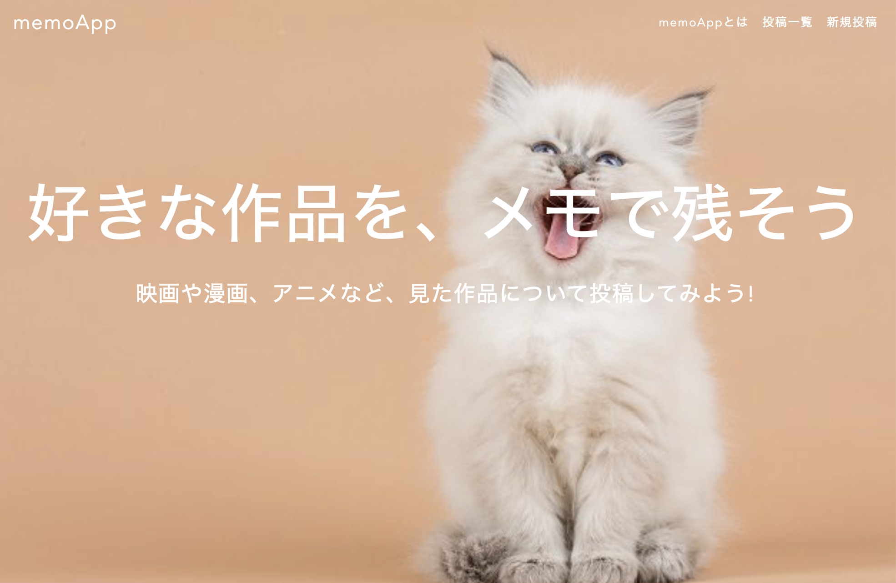
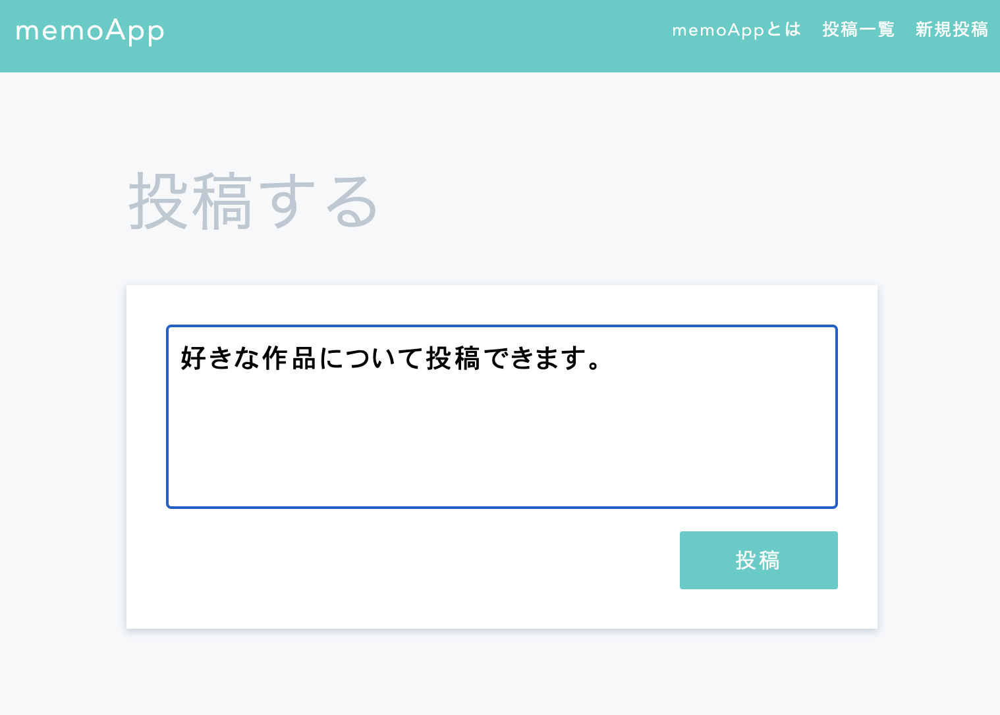
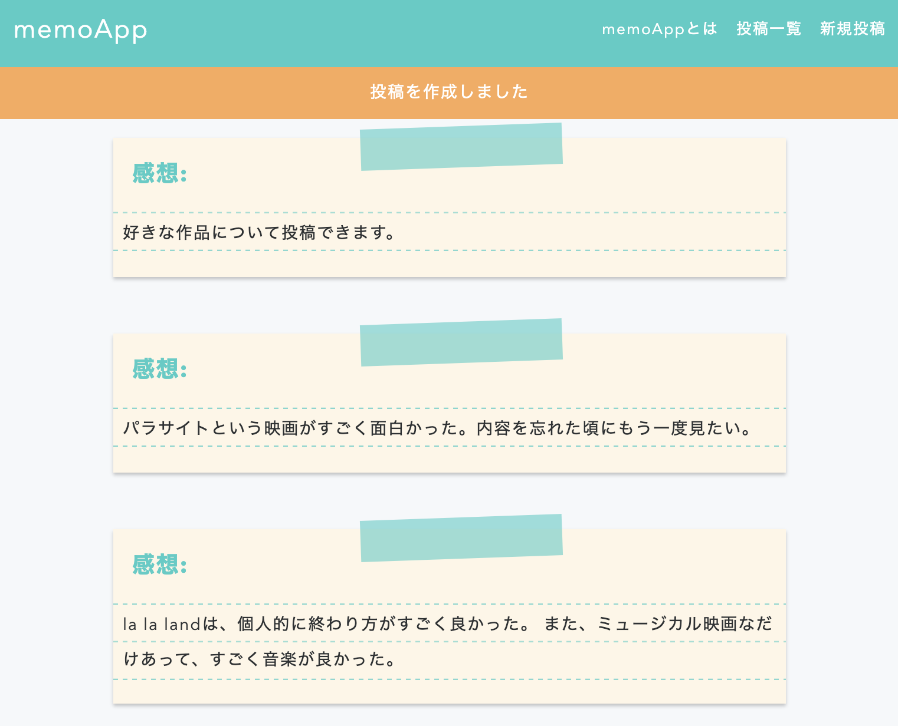
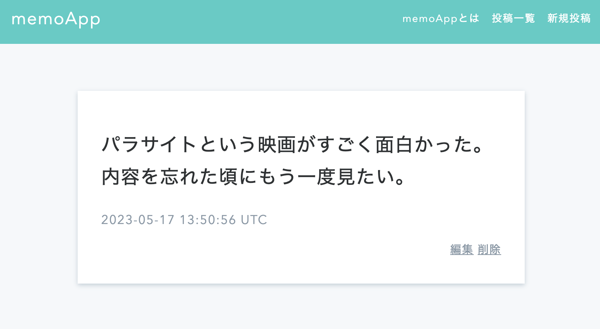

# memoApp
好きな作品をメモに残すことができるwebアプリを作成しました。



## 目次
- [使い方](#使い方)
- [技術スタック](#技術スタック)
- [実行](#実行)
- [今後](#今後)

## 使い方
- 「新規投稿」から新しくメモを投稿することができます。
  
   

- これまでの投稿は投稿一覧から見ることができます。
  
  

- 投稿は後から編集することや削除することも可能です。
  
  


## 技術スタック
- Ruby 3.1.4
- Ruby on Rails 7.0.4.3

## 実行
サーバーの起動
```bash
rails server
```
    
アクセス先： http://localhost:3000/　

## 今後
ユーザの新規作成、編集やユーザのログイン機能などを追加したいと考えています
